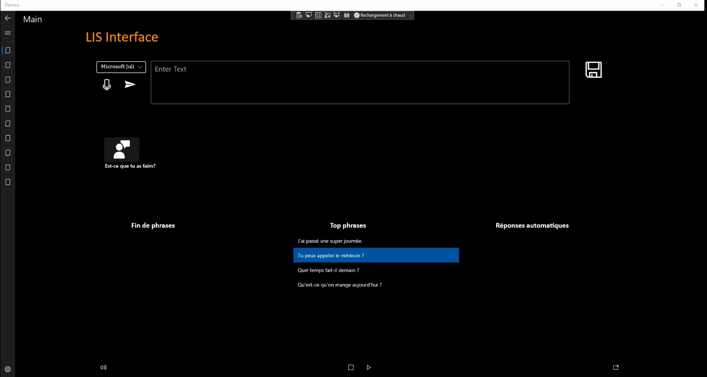

# Code du projet

## introduction

L’objectif de ce projet est de créer une interface permettant aux personnes LIS de communiquer. Les personnes LIS sont atteintes, à la suite d’un accident vasculaire cérébral, d’un handicap moteur. Ce handicap entraîne une tétraplégie et une incapacité à communiquer verbalement. Leur unique moyen de communication est le mouvement oculaire et le clignement des yeux. Les solutions existantes étant trop lentes, notre solution se doit d’être plus rapide afin de fluidifier la communication. Microsoft souhaite donc apporter son expertise en Intelligence Artificielle afin de créer une solution intelligente qui génère du contenu conversationnel.


[Présentation vidéo de notre projet] (https://youtu.be/H3h23GPTckI)

## Lancer le projet

Après avoir cloné le projet, il faut avoir python et lancer la commande ci-dessous pour installer les librairies requises.
```
pip install requirements.txt

```
Il faut ensuite avoir visual studio et lancer le projet qui se trouve dans la partie interface.

## I. Interface

Notre interface UWP (Universal Windows Platform) présente les deux sous-parties suivantes:.
-    	Demoo.core
-    	UWP-app-pi2
Demoo.core correspond aux fonctionnalités Microsoft possibles dans une application UWP (gestion des photos, prendre des photos, gérer les paramètres de l’application, webView, mediaPlayer).                                               	   
UWP-app-pi2 correspond quant à lui aux fonctionnalités propres à l’application, c'est-à-dire Speech-to-text, text-to-speech, affichage de l’aide prédictive, etc.  	  




## II. Backend 

### 1. IA de génération de texte

Concernant ce modèle, notre but est de finir les phrases écrites par la personne LIS.  L’idée est de parvenir à générer la phrase voulue par l’utilisateur avant qu’il ait fini de l’écrire. Nous avons donc cherché différents modèles de génération de texte et nous avons trouvé GPT-2 et GPT-3. GPT-3 est sûrement le meilleur modèle pour ce que nous voulons, mais il n’est pas accessible au grand public pour l’instant. Si à l’avenir celui-ci est disponible, il sera probablement le meilleur choix pour cette application.

Nous nous sommes donc concentrés sur GPT-2. Il a cependant été uniquement entraîné en anglais. Nous avions donc 2 possibilités.
La première possibilité est de traduire le début de la phrase écrite par la personne LIS, puis de la donner au modèle afin qu’il génère une fin de phrase logique. Il faut ensuite re-traduire la fin de phrase et l’afficher sur l’interface. Cette solution à l'avantage d’utiliser le modèle GPT-2 tel quel, qui est l’un des meilleurs pour la prédiction. En revanche, il introduit des biais à cause de la double traduction anglais/français. Nous avons utilisé pour la traduction une API gratuite, il y a cependant la possibilité d’utiliser l’API payante de Deepl qui est très utilisée et fait de très bonnes traductions.
 
La seconde possibilité est de “fine-tune” le modèle anglais pour qu’il puisse prédire en français. Il faut donc lui “apprendre” le français en lui donnant de nombreux textes écrits en français. L’avantage de cette solution est que le modèle créé ne possède plus le biais dû à la traduction. 	C’est en revanche une tâche fastidieuse qui nécessite de nombreux textes en français ( plusieurs giga de données) et une puissance informatique conséquente. Cette IA a été entraînée à l’aide de discussions REDIT dans un premier temps. Nous nous sommes rendus compte que les discussions utilisées pour entraîner l’IA comportaient de nombreuses fautes d’orthographe et le contenu  était trop éloigné de la réalité. Nous avons alors utilisé les sous-titres de films car ils sont censés être représentatifs de la réalité. Nous avons pris les 10 saisons de la série « Friends », mais ces données ne représentaient que 5 Mo de discussion.

Nous avons décidé d’utiliser le modèle qui traduit les phrases et génère du texte avec GPT-2 car la prédiction est meilleure pour l’instant étant donné que nous n’avons pas entraîné l’autre modèle sur beaucoup de textes. Notre idée était cependant d'entraîner ce modèle d’autres sous-titres de séries récentes pour avoir des conversations « réelles ». Une fois que l’application sera utilisée par des personnes LIS il sera possible de récupérer le contenu généré dans une base de données. Par la suite, nous utiliserons cette base de données pour améliorer notre modèle et le rendre plus précis. 

### 3. IA pour répondre aux questions

Ce modèle permet de proposer des réponses aux questions posées par un interlocuteur à la personne LIS.

Le modèle a été créé à l’aide de Transformers 2.11 .0 ainsi que BERT et Keras et a été entrainé à l’aide d’un corpus anglais.
Une fois le pré-processing réalisé sur le dataset, le modèle permet de le tokenizer puis de l’injecter dans un modèle séquentiel à l’aide Keras.
Celui-ci va être entraîné et évalué sur la dataset. L’IA obtient une performance globale de 0.85. Cette IA prend en entrée deux phrases et retourne un des statuts suivants: contradiction, neutral, et entailment avec pour chacun le taux de confiance correspondant.

Enfin, nous utilisons un dataset d’interactions sur lequel nous regardons la ressemblance entre la question posée et celles contenues dans le dataset. Nous choisissons les questions du dataset qui ont le plus de similarité avec celles posées et proposons ensuite les réponses correspondantes à l’utilisateur . Ce modèle nécessite donc un dataset qui contient déjà des questions-réponses.


## III. API

Lorsqu’une demande est émise de la part de l’application UWP pour une prédiction, celle-ci est prise en charge par l’API flask en python.
Suite à l’appel, la réponse de l’API dépendra du type de demande faite :

### 1. Réponses aux questions :

La phrase est prise en compte dans le JSON envoyé par l’application. Elle est ensuite traduite en anglais. Puis, le calcul de similarité est effectué pour chaque phrase qui compose le dataset avec la phrase issue de l’application. Le programme choisit les phrases qui ont le plus de similarité avec celles posées et les envoie par la suite pour répondre à l’appel de l’application.

### 2. Propositions de fin de phrases :

Le début de phrase est pris en compte dans le JSON envoyé par l’application. La phrase est par la suite traduite en anglais et injectée dans le modèle numéro 1.  Le modèle prédit une fin de phrase, puis elle est de nouveau traduite de l’anglais vers le français en réponse à l’appel de l’application.  Ce modèle propose trois fin de phrases possibles (ce paramètre peut être changé).

Il est important de noter que l’un des ports de l’API permet d'inscrire une phrase dans une base de données. Cela permet par la suite d'utiliser ces phrases pour améliorer notre modèle. Ce port n'a pas encore été utilisé dans dans l'application UWP.

